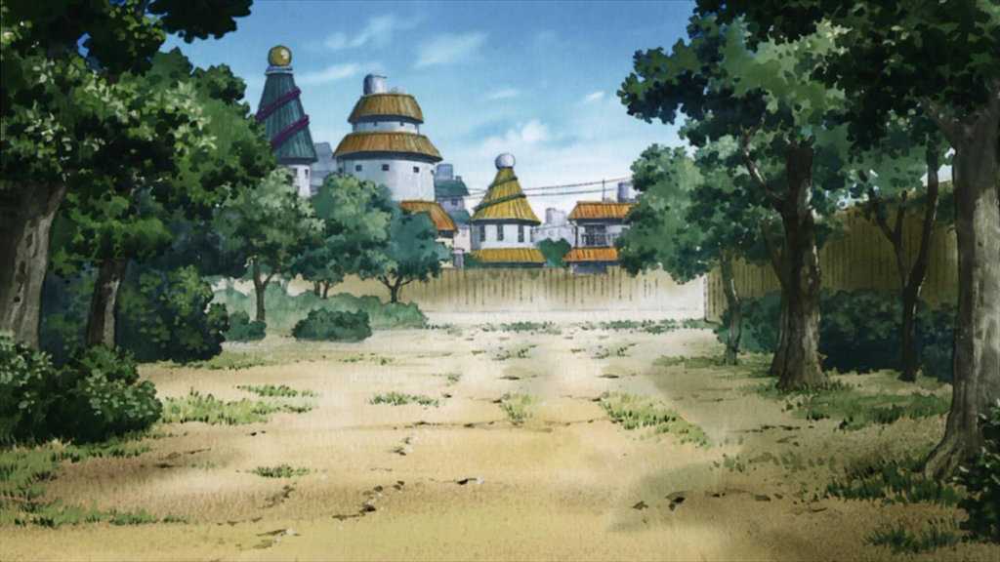

# Naruto RPG

## Problem
The challenge was to dynamically repopulate content to seperate locations in the DOM and having different reactions to user input for every update.
We also were challenged with generating random attack values and setting up win/lose conditions. 

## Approach 
I found that the best way to dynamically change content and interactions was to add and remove classes.
This way I could build the iniatial setup and then as the game progressed I would change the classes to create the next step in the game.
Every function as you progress is triggered depending on the classes assigned to the characters and as every stage completes they're updated.

